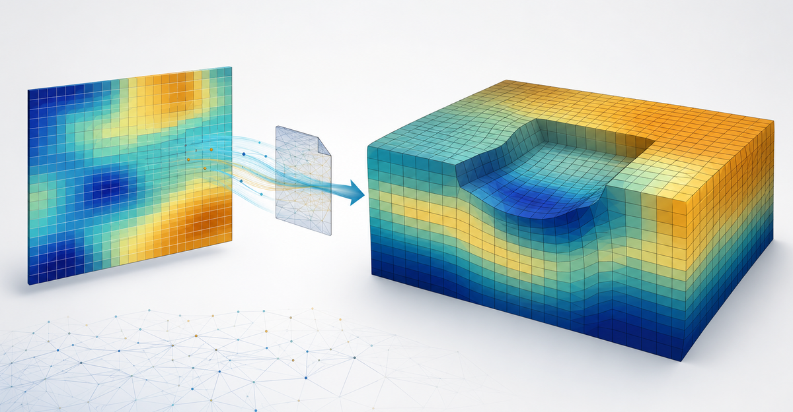

# RFieldMesh 1.0.0

RFieldMesh is an independent open-source scientific application for generating
reproducible spatial random fields and assigning them safely to finite-element
models.



The stable release provides a numerical Python API, Abaqus inspection and
writing services, a command-line interface, offline interactive
visualizations, deterministic batch generation, a five-tab desktop
application, and fail-closed native release validation.

## Implemented capabilities

- exponential and squared-exponential latent Gaussian correlation;
- normal, lognormal, and moment-fitted truncated-normal marginals;
- deterministic PCG64DXSM streams for independent properties;
- corrected two-dimensional Fourier spectral simulation;
- analytical Gaussian averaging over rectangular elements;
- covariance/Karhunen–Loève simulation on irregular 2D or 3D coordinates;
- source-preserving Abaqus tokenization and semantic parsing;
- first-order continuum-element eligibility filtering;
- instance translation and axis-angle transformation;
- complete source-material cloning with selective property replacement;
- registry-driven randomization of Young's modulus, density, Poisson's ratio,
  friction angle, dilation angle, and cohesion;
- column-aware preservation of companion values in `*Elastic` and
  `*Mohr Coulomb` rows, plus the hardening companion column beside cohesion;
- section-remainder handling for mixed-type and partial regions;
- atomic model and manifest publication followed by independent reparsing;
- unsaved previews using the production numerical path;
- structured 2D, general 2D, and 3D Plotly figures;
- self-contained offline HTML reports;
- preflighted, cancellable multi-realization batches;
- five-tab PySide6 GUI with responsive background work;
- Windows PyInstaller one-folder packaging assets;
- versioned Windows, Abaqus, source-quality, and user-acceptance evidence;
- a release audit that cannot approve missing, stale, duplicate, or failed gates.

## Installation

Core and CLI:

```bash
python -m pip install rfieldmesh
```

Visualization:

```bash
python -m pip install "rfieldmesh[visualization]"
```

Desktop:

```bash
python -m pip install "rfieldmesh[desktop]"
rfieldmesh-gui
```

Development:

```bash
python3.12 -m venv .venv
.venv/bin/python -m pip install --upgrade pip
.venv/bin/python -m pip install -e ".[dev,desktop,packaging]"
```

Python 3.12–3.14 is supported by the package metadata. Linux desktop hosts must
also provide the standard Qt/OpenGL system libraries required by PySide6.

## Desktop workflow

Launch:

```bash
rfieldmesh gui
```

The interface guides the user through:

1. selecting and inspecting an Abaqus `.inp` model;
2. choosing a part, instance, element set, and material properties;
3. defining correlation, mapping, algorithm, and seeds;
4. generating and reviewing an unsaved interactive preview;
5. generating one or more independently validated Abaqus models.

Inspection, preview, and generation execute outside the GUI thread. Cancellation
is cooperative and is applied at safe boundaries between realizations.

## Command-line workflows

Inspect:

```bash
rfieldmesh inspect Job-1.inp
rfieldmesh inspect Job-1.inp --output inspection.json
```

Preview without writing an Abaqus model:

```bash
rfieldmesh preview examples/phase4_generation.json \
  --output random_field_preview.html
```

Generate one model:

```bash
rfieldmesh generate examples/phase4_generation.json
```

Generate a batch:

```bash
rfieldmesh batch examples/phase5_batch.json
```

Relative paths in JSON files are resolved relative to the configuration file.
The batch filename template may use `{index}`, `{realization}`, and `{seed}`.
All model, manifest, and summary paths are checked for uniqueness and collision
before the first realization is written.

## Supported Abaqus elements

- `CPE3`, `CPE4`, `CPE4R`;
- `CPS3`, `CPS4`, `CPS4R`;
- `CAX3`, `CAX4`, `CAX4R`;
- `C3D4`, `C3D8`, `C3D8R`.

Other types, including `AC3D8R`, are excluded explicitly and reported. They
remain assigned to the original material through a generated remainder set
when necessary.

## Automatic numerical choices

With `algorithm: "auto"`:

- a complete axis-aligned 2D quadrilateral grid with exponential correlation
  uses the spectral method;
- a general eligible 2D or 3D region uses covariance/KL, subject to its
  automatic dense-memory estimate and scalable low-rank covariance path.

With `mapping: "auto"`:

- structured spectral generation uses analytical rectangular Gaussian
  averaging for normal/lognormal variables and centroid sampling for bounded
  truncated-normal variables;
- covariance/KL uses element representative-point sampling.

For structured two-dimensional bounded fields, `algorithm: "auto"` first tries
the configured spectral retained-variance target without modification. If that
centroid-sampled representation cannot fit the configured mode or coefficient
budget, it retries at `0.995` per spatial direction (at least approximately
`0.990` combined point variance), compacts mode-count overshoot, and records
the requested and effective targets in the field diagnostics. Existing
spectral cases that already fit retain their historical mode sets. Selecting
`algorithm: "spectral"` explicitly disables this automatic adjustment and
keeps the configured target strict.

Configured moments are point-scale physical-property moments. Local averaging
reduces field variance. For non-Gaussian fields, configured correlation applies
to the latent Gaussian field.

General-coordinate generation estimates dense workspace before allocation.
When the configured dense-memory budget would be exceeded, RFieldMesh uses a
matrix-free pivoted covariance factor whose residual-trace stopping rule
enforces the requested retained-variance fraction. Capacity therefore depends
on the retained variance, correlation scales, mode budget, available memory,
and mesh size rather than a fixed element-count limit. See
[`KNOWN_LIMITATIONS.md`](KNOWN_LIMITATIONS.md).

The complete six-property examples are:

```bash
rfieldmesh generate examples/all_six_2d.json
rfieldmesh generate examples/all_six_3d.json
```

Older five-property configurations remain valid and retain their original
property-specific random streams. Cohesion uses the stable identifier
`cohesion`, is nonnegative, and maps to the first value in the first data row
under the resolved material's `*Mohr Coulomb Hardening` keyword. RFieldMesh
changes only that value and preserves every companion value and unrelated
material card. A missing, dependent, multiline, duplicate, or otherwise
ambiguous hardening card is rejected rather than inferred.

## Verification

```bash
python -m pytest
python -m pytest --cov=rfieldmesh --cov-report=term-missing
python -m ruff check .
python -m ruff format --check .
python -m mypy src
python -m build
```

Phase-specific validation:

```bash
python scripts/validate_phase3.py
python scripts/validate_phase4.py \
  --model-2d validation/representative_models/2D-Model.inp \
  --model-3d validation/representative_models/3D-Model.inp
python scripts/validate_phase5.py \
  --model-2d /path/to/Job-1.inp \
  --model-3d /path/to/Representative_3D_Model.inp
python scripts/validate_phase6.py \
  --model-2d /path/to/Job-1.inp \
  --model-3d /path/to/Representative_3D_Model.inp
python scripts/run_source_quality.py
```

## Windows application

PyInstaller must build Windows executables on Windows:

```powershell
.\packaging\windows\build.ps1
```

The build runs tests, linting, formatting, strict typing, source-GUI and
packaged-GUI smoke tests, a lock-enforced dependency installation, licence
inventory, complete LGPL/GPL notices, evidence generation, and archive
checksums. The build host necessarily contains Python. Extract the resulting
ZIP on a separate Windows account with no Python command available, then run:

```powershell
.\validation\clean_machine_test.ps1
```

Native Abaqus instructions are in `packaging/abaqus/README.md`. For a new
binary build or maintenance release, complete the Windows, Abaqus, and
user-acceptance protocols, then audit all evidence:

```bash
rfieldmesh release-audit validation/release_candidate/evidence --require-ready
```

The command returns a failure status unless every mandatory gate passed for the
same application version.

## Current limitations

- included content may be inspected, but generation is refused when
  `*INCLUDE` is present;
- each configured region must inherit one unambiguous original section;
- only scalar one-row `*Density`, isotropic `*Elastic`, and `*Mohr Coulomb`
  property rows without dependencies are modified;
- scalable general-coordinate factorization remains low-rank and may stop with
  a resource error when the requested variance cannot be retained within the
  configured mode and memory budgets;
- the spectral mapper requires a complete, axis-aligned, structured 2D
  quadrilateral mesh;
- general unstructured area/volume averaging is not implemented;
- repeated-instance independent fields and distribution-based Abaqus
  assignments are deferred;
- batch execution is sequential;
- the provided Windows packaging creates an unsigned ZIP, not an installer.

The complete applicability statement and planned extensions are maintained in
[`KNOWN_LIMITATIONS.md`](KNOWN_LIMITATIONS.md).

## Citation

Citation metadata is provided in [`CITATION.cff`](CITATION.cff). When a DOI is
assigned to an archived release, cite the archived version and retain the
software version used for the analysis.

Publication-ready manuscript materials, highlights, release metadata, and the
graphical abstract are available in [`docs/publication`](docs/publication).

## Contributing and security

See [`CONTRIBUTING.md`](CONTRIBUTING.md) for development and reporting guidance.
Potential security vulnerabilities should be handled according to
[`SECURITY.md`](SECURITY.md), not through a public issue.

## Disclaimer

RFieldMesh is an independent open-source project. It is not affiliated with,
endorsed by, sponsored by, or otherwise associated with Dassault Systèmes or
the Abaqus product family. Abaqus is a trademark of Dassault Systèmes or its
subsidiaries.
