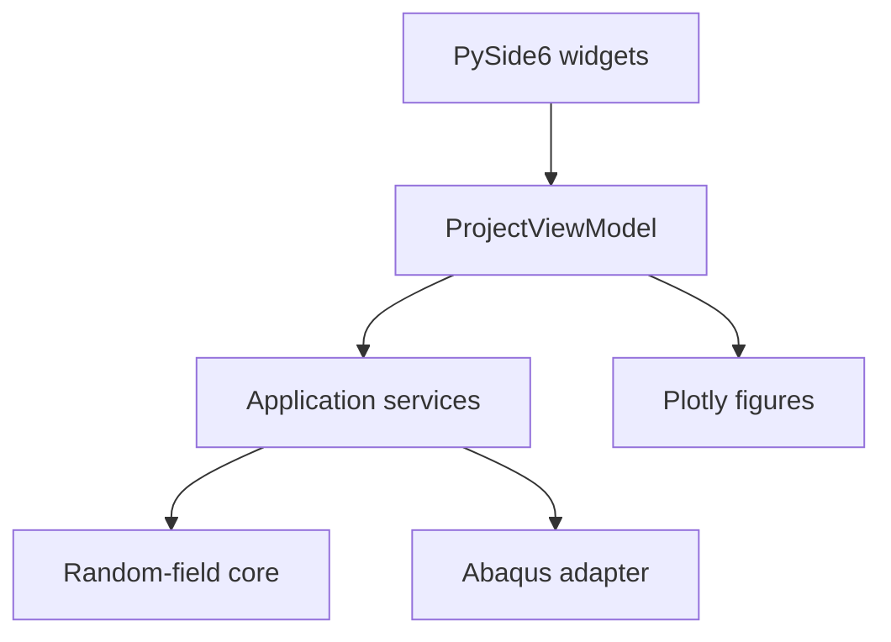

# Phase 5 desktop, visualization, and batch architecture

## Scope

Phase 5 adds presentation and orchestration without relocating numerical or
Abaqus semantics into the GUI. The CLI and PySide6 application call the same
inspection, preview, generation, and validation services.

## Dependency boundary

`ProjectViewModel` is independent of Qt and is directly unit tested. Widgets
manage only presentation state and convert form values into validated Pydantic
configuration objects. Numerical arrays and Abaqus source edits remain outside
widget classes.

## Preview

`preview_model()` parses the source, resolves eligibility and section coverage,
and generates the same `FieldGeneration` objects used by final generation. It
does not invoke the Abaqus writer. Consequently, a preview cannot modify the
source or create an output model.

The visualization layer consumes the immutable preview result:

- complete structured 2D regions use a heatmap;
- general 2D regions use WebGL centroid markers;
- 3D regions use centroid scatter with interactive rotation;
- every field receives a histogram and empirical CDF;
- HTML reports embed Plotly JavaScript and operate offline.

## Batch preflight and execution

Before generating any realization, `plan_batch()` resolves every filename,
manifest path, and the summary path. It rejects:

- path traversal;
- filename templates without `.inp`;
- nonunique rendered filenames;
- collisions with the source model;
- existing outputs unless overwrite was explicitly enabled.

Generation is sequential in Phase 5. This keeps memory use bounded and avoids
simultaneous large Abaqus writes. Expensive realization-independent numerical
preparation may be cached in a later version.

Cancellation is cooperative. It is checked between realizations. A currently
running eigendecomposition or atomic write is allowed to reach a safe boundary.
The batch summary records completed and failed realizations and whether
cancellation was requested.

## Desktop threading

All inspection, preview, and batch operations run through `FunctionWorker` in
the global Qt thread pool. Uncaught worker exceptions are converted to
user-facing error signals, preventing failures from terminating the event
loop. Batch progress uses immutable `BatchProgress` objects.

The interface follows five tabs:

1. model inspection;
2. region and variables;
3. correlation and simulation;
4. preview and statistics;
5. output and batch generation.

## Windows packaging

The release uses a PyInstaller one-folder build. The Windows PowerShell workflow
creates a clean Python 3.12 environment, runs the complete source-quality suite,
builds the application, launches source and packaged GUI smoke tests, includes
licence notices, and creates a versioned ZIP. Windows artifacts are built on
Windows because PyInstaller is not a cross-compiler.
